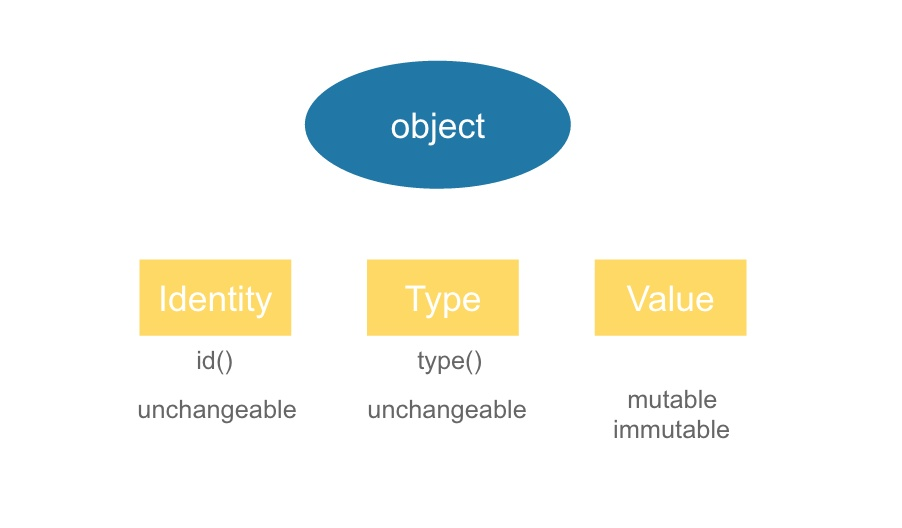
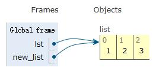

Python 赋值，浅拷贝，深拷贝
=========================

> 直接赋值：对象的引用（别名）。    
> 浅拷贝(copy)：拷贝父对象，不会拷贝对象的内部的子对象。    
> 深拷贝(deepcopy)： copy模块的deepcopy方法，完全拷贝了父对象及其子对象。    

# 0 对象

在Python里，一切皆对象，完全的面向对象。  
#### Python对象三要素：Id，Type，Value
> Id：唯一标识一个对象   
> Type：标识对象的类型  
> Value：对象的值  

a is b 判断 a 对象是否就是 b 对象（通过id来判断）   
a == b 判断 a 对象的值是否和 b 对象的值相等（通过value来判断）     

<div align=center>

</div>
<div align=center>图1.1 对象三要素</div>

# 1 赋值和引用
先来看一下 Python 中的赋值与引用。

``` python
lst = [1, 2, 3]
new_list = lst
print(id(lst)==id(new_list))
```
从字面上看，上述语句创建了变量 lst 和 new_list，并且 lst 和 new_list 的赋值都为一个列表。但是，Python 的赋值语句并不会复制对象，而是会重新创建一个对象的引用。C 程序更新的是内存单元中存放的值，而 Python更新的是变量的指向，是一种完全不同的机制。
<div align=center>

</div>
<div align=center>图1.2 赋值与引用</div>

可以看出，lst 和 new_list 都引用了同一个列表。

 

Python 中的赋值语句不会创建对象的拷贝，仅仅只是将名称绑定至一个对象。对于不可变对象，通常没什么差别，但是处理可变对象或可变对象的集合时，你可能需要创建这些对象的 “真实拷贝”，也就是在修改创建的拷贝时不改变原始的对象。

# 2 浅拷贝和深拷贝

浅拷贝：浅拷贝意味着构造一个新的集合对象，然后用原始对象中找到的子对象的引用来填充它。从本质上讲，浅层的复制只有一层的深度。复制过程不会递归，因此不会创建子对象本身的副本。    
深拷贝：深拷贝使复制过程递归。这意味着首先构造一个新的集合对象，然后递归地用在原始对象中找到的子对象的副本填充它。以这种方式复制一个对象，遍历整个对象树，以创建原始对象及其所有子对象的完全独立的克隆。

